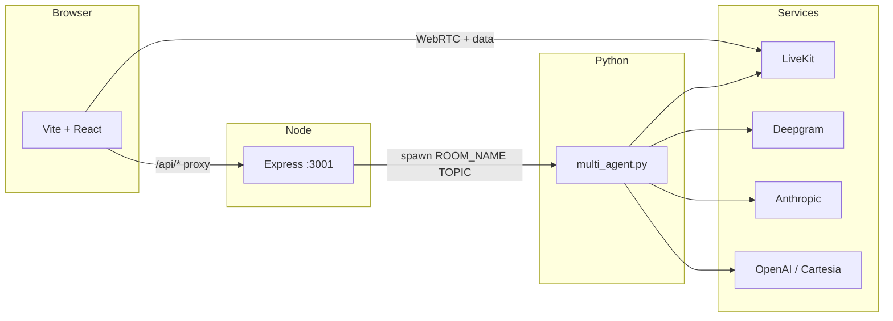

# Agora

**Live, multi-agent voice discussions** in the browser. You pick a topic, join a LiveKit room, and talk with **Edge**, **Sage**, and **Spark**—each with its own voice and point of view—while a React UI shows presence, motion, and the running transcript.

Pipeline under the hood: **Deepgram** (speech-to-text) → **Anthropic Claude** (reasoning) → **OpenAI or Cartesia** (text-to-speech), orchestrated from Python and wired through [LiveKit](https://livekit.io/).

---

## Why it’s interesting

- **Real-time audio** — Agents and you share one room; interruptions and turn-taking are handled in code (urgency scoring, room locks, idle timeouts).
- **One command to hack** — `./start.sh` installs deps, boots the API on **:3001**, and runs Vite with `/api` proxied for a smooth dev loop.
- **Two ways to run agents** — The **web app** spawns `multi_agent.py` per room via Express. For manual testing (fixed room `agora-discussion`, `join_room.html`, `mint_token.py`), see [**backend/README.md**](backend/README.md).

---

## Architecture



---

## Prerequisites

- **Node.js** 18+ and **npm**
- **Python** 3.10+
- [LiveKit Cloud](https://cloud.livekit.io/) (or compatible) project
- API keys: [Deepgram](https://console.deepgram.com/), [Anthropic](https://console.anthropic.com/), and **either** [OpenAI](https://platform.openai.com/) **or** [Cartesia](https://play.cartesia.ai/) for TTS (see `TTS_PROVIDER` below)

---

## Quick start

1. **Clone and configure environment**

   ```bash
   git clone https://github.com/ebeetles/Agora.git
   cd Agora
   cp backend/.env.example backend/.env
   ```

   Edit **`backend/.env`**. `LIVEKIT_URL` must be the **WebSocket** URL (`wss://…`), not the HTTP dashboard URL.

2. **Run everything**

   ```bash
   chmod +x start.sh   # once
   ./start.sh
   ```

   Then open the URL Vite prints (usually **http://localhost:5173**). Enter a topic, connect your mic, and start talking.

---

## Environment variables

All secrets live in **`backend/.env`** (gitignored). Copy from [`backend/.env.example`](backend/.env.example).

| Variable | Purpose |
|----------|---------|
| `LIVEKIT_URL` | WebSocket URL for your LiveKit project |
| `LIVEKIT_API_KEY` / `LIVEKIT_API_SECRET` | Server SDK + token minting |
| `DEEPGRAM_API_KEY` | Streaming STT |
| `ANTHROPIC_API_KEY` | Claude |
| `TTS_PROVIDER` | `openai` (default) or `cartesia` |
| `OPENAI_API_KEY` | Required when `TTS_PROVIDER=openai` |
| `CARTESIA_API_KEY` | Required when `TTS_PROVIDER=cartesia` |
| `DISABLE_TTS` | Set to `true` to print lines only (saves TTS credits); multi-agent path only |

Optional: `SERVER_PORT` for Express (default **3001**).

**Never commit `.env`.** This repo ignores `**/.env` and only ships `.env.example` placeholders.

---

## Manual dev (without `start.sh`)

If you prefer separate terminals:

```bash
# Terminal 1 — API (from repo root)
cd backend && npm install
node server.js

# Terminal 2 — frontend
npm install && npm run dev
```

Ensure `backend/.venv` exists and `pip install -r backend/requirements.txt` has been run; `server.js` spawns `multi_agent.py` with that interpreter when you create a room from the UI.

---

## Project layout

| Path | Role |
|------|------|
| [`src/`](src/) | React UI (LiveKit Components, Framer Motion, Tailwind) |
| [`backend/server.js`](backend/server.js) | REST: create room, mint token, spawn agents, teardown |
| [`backend/multi_agent.py`](backend/multi_agent.py) | Multi-agent orchestration, STT/LLM/TTS |
| [`backend/launch.py`](backend/launch.py) | CLI entry for fixed-room / local workflows |
| [`backend/agent.py`](backend/agent.py) | Single LiveKit worker agent (**Edge** only) |
| [`backend/README.md`](backend/README.md) | Deep dive: Playground, `join_room.html`, `mint_token.py`, billing tips |

---

## Scripts

| Command | Description |
|---------|-------------|
| `./start.sh` | Install deps, start API + Vite |
| `npm run dev` | Frontend only (API must be up for full flow) |
| `npm run build` | Production build |
| `npm run lint` | ESLint |

---

## Contributing & security

If you open a PR, double-check that no real keys are in the diff. Rotate any key that has ever appeared in a commit or public issue.

---

## License

No license file is bundled yet; add one if you open-source under specific terms.
