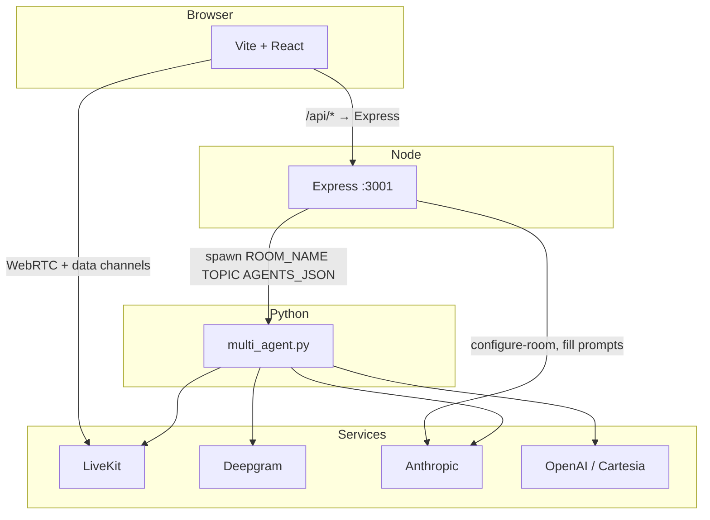

# Agora

**Agora** is a browser-based **live voice roundtable**: you choose a topic, Agora **designs a cast of 2–4 AI participants** (names, perspectives, voices, and motion “personalities”), and you **join the same LiveKit room** to talk with them in real time. A React UI shows **who is speaking**, **live captions**, a **running transcript**, and a **topic** you can refine mid-session.

Under the hood: **Deepgram** (speech-to-text) → **Anthropic Claude** (reasoning and room configuration) → **OpenAI or Cartesia** (text-to-speech), coordinated by **Python** (`multi_agent.py`) and **Express** (`server.js`), with audio over **LiveKit**.

---

## What you do (end-to-end)

1. **Landing** — Enter any topic (a decision, debate, or question). Optional example pills nudge you toward a first try.
2. **Configure** — The app calls **`POST /configure-room`**. Claude proposes a **room mood**, **topic framing**, and a **cast** (each agent gets colors, a short disposition, visual personality axes for the UI, and a full system prompt).
3. **Preview** — Review the lineup: **edit** names and dispositions, **add or remove** agents, or **regenerate** the whole room from the same topic. When you are ready, you **launch** the session.
4. **Room** — The server creates a **unique LiveKit room**, spawns **`multi_agent.py`** with your topic and cast, and returns a **participant token**. You connect the **microphone**, hear the agents, and speak naturally. The UI syncs **speaking / thinking** state and **captions** from the agents via LiveKit data messages. You can **change the discussion topic** in place (the server forwards it to the Python process).

If you skip the AI-designed cast (e.g. API failure or future paths), the backend can fall back to the **default three-agent** configuration (**Edge**, **Sage**, **Spark**) from `backend/config.py`.

---

## Why it’s interesting

- **Topic-native casts** — Agents are generated for *your* topic, not a single fixed script.
- **Real-time audio** — Shared room, interruption handling, urgency-based turn-taking, room locks, and idle behavior are implemented in `multi_agent.py` (see [**backend/README.md**](backend/README.md) for behavior details).
- **One command for local dev** — `./start.sh` installs dependencies, starts the API on **:3001**, and runs Vite with **`/api` proxied** to Express.
- **Two ways to run agents** — The **web app** is the primary path (per-room processes). For a **fixed room** (`agora-discussion`), **`join_room.html`**, and **`mint_token.py`**, use [**backend/README.md**](backend/README.md).

---

## Architecture



---

## Prerequisites

- **Node.js** 18+ and **npm**
- **Python** 3.10+
- A [LiveKit Cloud](https://cloud.livekit.io/) (or compatible) project
- API keys: [Deepgram](https://console.deepgram.com/), [Anthropic](https://console.anthropic.com/), and **either** [OpenAI](https://platform.openai.com/) **or** [Cartesia](https://play.cartesia.ai/) for TTS (`TTS_PROVIDER` in `.env`)

**First time running the Python agents:** from `backend/`, after `pip install -r requirements.txt`, run `python agent.py download-files` if you need Silero VAD assets (see backend README).

---

## Quick start

1. **Clone and configure**

   ```bash
   git clone https://github.com/ebeetles/Agora.git
   cd Agora
   cp backend/.env.example backend/.env
   ```

   Edit **`backend/.env`**. **`LIVEKIT_URL`** must be the **WebSocket** URL (`wss://…`), not an HTTP dashboard URL.

2. **Run everything**

   ```bash
   chmod +x start.sh   # once
   ./start.sh
   ```

   Open the URL Vite prints (usually **http://localhost:5173**). Walk through **topic → preview → join**, allow the microphone when prompted, and start talking.

---

## Environment variables

Secrets live in **`backend/.env`** (gitignored). Copy from [`backend/.env.example`](backend/.env.example).

| Variable | Purpose |
|----------|---------|
| `LIVEKIT_URL` | WebSocket URL for your LiveKit project |
| `LIVEKIT_API_KEY` / `LIVEKIT_API_SECRET` | Server SDK access and JWT minting |
| `DEEPGRAM_API_KEY` | Streaming STT in `multi_agent.py` |
| `ANTHROPIC_API_KEY` | Claude in Python **and** room configuration / prompt fill in `server.js` |
| `TTS_PROVIDER` | `openai` (default) or `cartesia` |
| `OPENAI_API_KEY` | Required when `TTS_PROVIDER=openai` |
| `CARTESIA_API_KEY` | Required when `TTS_PROVIDER=cartesia` |
| `DISABLE_TTS` | `true` = log lines only, no TTS (multi-agent path; saves provider credits) |

Optional: **`SERVER_PORT`** for Express (default **3001**).

**Never commit `.env`.** This repo ignores `**/.env` and only ships `.env.example`.

---

## HTTP API (Express)

All routes are mounted at the **root** on the API server; the Vite dev server proxies **`/api/*`** → **`http://localhost:3001/*`** (see [`vite.config.ts`](vite.config.ts)).

| Method | Path | Purpose |
|--------|------|---------|
| `POST` | `/configure-room` | Body: `{ topic }`. Returns JSON: `roomMood`, `topicFraming`, `agents[]` (Claude-generated cast and UI metadata). |
| `POST` | `/create-room` | Body: `{ topic, agents? }`. Mints a human token, spawns `multi_agent.py` for a new `agora-…` room, returns `roomName`, `token`, `wsUrl` / `livekitUrl`, and `agents` for the UI. |
| `POST` | `/update-topic` | Body: `{ roomName, newTopic }`. Sends a command to the running agent process to update the discussion topic. |
| `DELETE` | `/room/:roomName` | Stops the agent subprocess for that room (called when you leave from the UI). |

---

## Frontend (high level)

| Area | Role |
|------|------|
| [`src/App.jsx`](src/App.jsx) | Phases: entry → configuring → preview → room; wires API calls and session state. |
| [`src/components/EntryScreen.jsx`](src/components/EntryScreen.jsx) | Topic capture and onboarding narrative. |
| [`src/components/PreviewScreen.jsx`](src/components/PreviewScreen.jsx) | Cast review, edit, regenerate, launch. |
| [`src/components/Room.jsx`](src/components/Room.jsx) | LiveKit connection, mic, layout, transcript panel, agent presences. |
| [`src/components/AgentPresence.jsx`](src/components/AgentPresence.jsx) | Per-agent motion and speaking / thinking visuals. |
| [`src/components/TopicObject.jsx`](src/components/TopicObject.jsx) | In-room topic display and topic updates via API. |
| [`src/hooks/useDiscussionState.js`](src/hooks/useDiscussionState.js) | LiveKit data messages → transcript, captions, per-agent UI state. |
| [`src/lib/layoutAgents.js`](src/lib/layoutAgents.js) | Positions agent cards in the room view. |

Stack: **React 19**, **LiveKit Components**, **Framer Motion**, **Tailwind CSS 4**, **Vite 8**.

---

## Manual dev (without `start.sh`)

```bash
# Terminal 1 — API (repo root or backend)
cd backend && npm install && node server.js

# Terminal 2 — frontend
cd /path/to/Agora && npm install && npm run dev
```

Ensure **`backend/.venv`** exists and **`pip install -r backend/requirements.txt`** has been run; `server.js` spawns `multi_agent.py` with that interpreter when you create a room from the UI.

---

## Project layout

| Path | Role |
|------|------|
| [`src/`](src/) | React app |
| [`backend/server.js`](backend/server.js) | Express: configure room, create room, update topic, mint token, spawn/stop agents |
| [`backend/multi_agent.py`](backend/multi_agent.py) | Multi-agent orchestration, STT / LLM / TTS |
| [`backend/discussion_state.py`](backend/discussion_state.py) | Shared discussion state for agents |
| [`backend/config.py`](backend/config.py) | Default Edge / Sage / Spark definitions and `agents_for_api()` |
| [`backend/launch.py`](backend/launch.py) | CLI entry for fixed-room / local workflows |
| [`backend/agent.py`](backend/agent.py) | Single LiveKit worker (**Edge** only) for Playground-style tests |
| [`start.sh`](start.sh) | One-shot dev bootstrap |
| [**backend/README.md**](backend/README.md) | Playground, `join_room.html`, `mint_token.py`, idle timeout, `DISABLE_TTS`, billing notes |

---

## Scripts

| Command | Description |
|---------|-------------|
| `./start.sh` | Install deps, start API + Vite |
| `npm run dev` | Frontend only (API must be running for full flow) |
| `npm run build` | Production build |
| `npm run lint` | ESLint |

---

## Contributing and security

Do not commit real API keys. Rotate any key that has appeared in a public commit or issue.

---

## License

No license file is bundled yet; add one if you open-source under specific terms.
